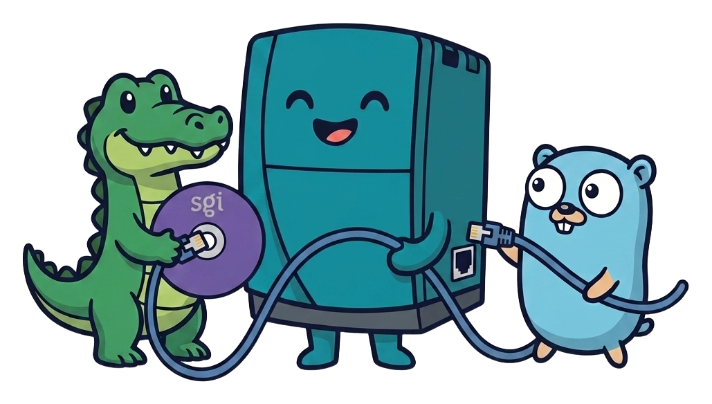

# instigator

<p align="center">
  
</p>

IRIX network installs usually start with prepared media: extract the discs,
construct a network tree, arrange the boot files, and make the installer see
the right sources. That preparation is easy to get subtly wrong and makes
experimentation expensive.

`instigator` is a single binary that serves an install directly from SGI CD
images. Point it at the images, give it a small YAML file, and it provides the
BOOTP, TFTP, and rsh services needed by the SGI PROM and `inst` session. The
images remain read-only and in place.

Multiple discs can be grouped into one install set. `instigator` reads the SGI
volume header and EFS filesystem directly, then presents the selected
distribution directories as one coherent tree. The installer sees the merged
tree, not the individual discs. Duplicate files must agree, and real
collisions are named in the configuration instead of being silently guessed.

The result is a repeatable path from local image files to a real IRIX install:
one server process, one configuration, and no staging tree to prepare first.

The current profile has completed on a real Octane2 with IRIX 6.5.30: the
machine netbooted, installed from merged media, booted from its disk, and
reached the IRIX console login.

## Quick start

Build the server:

```sh
go build -o instigator ./cmd/instigator
```

Copy [`instigator.example.yaml`](instigator.example.yaml), then set the
server address, the client MAC/IP, and the paths to your SGI images. Keep
layers in install order. The example shows the tested 6.5.30 profile,
including merged overlays, Foundations, Development Foundation/Libraries,
Applications, Complementary Applications, and optional Freeware.

Start the server on the install network:

```sh
sudo ./instigator serve instigator.yaml
```

At the Octane PROM command monitor, boot the configured set:

```text
setenv netaddr <octane-ip>
boot -f bootp():/<primary-set>/stand/fx.64
```

At `Remote Directory`, enter `/<primary-set>/dist`. At `Inst>`, load the
generated selections and start the install:

```text
admin source <server-ip>:/install.cmds
```

That is the short version. The [installation guide](docs/install.md) has the
full command sequence, profile ordering, first-boot checks, and captured
install notes.

## Host platforms

The server is pure Go and runs on Linux, macOS, and Windows. Real installs have
been proven on Linux (the Octane2 run above). macOS and Windows are supported
build and test targets.

Binding UDP 67 (BOOTP) and 69 (TFTP) — the ports the SGI PROM expects — needs
privilege. Use `sudo` on Linux and macOS. On Windows, run as Administrator and
allow UDP 67/69 and TCP 514 through the firewall. The installation guide covers
the multi-homed-host trap that bites laptops.

## Configuration

`install_sets` are the logical trees exposed to `inst`. Each set contains
ordered `layers`, and each layer names one `source`: a local path or an
`http(s)://` URL.

```yaml
install_sets:
  - name: "6.5.30"
    layers:
      - name: overlays1
        source: /media/irix/overlays1.image
        boot: true
      - name: overlays2
        source: /media/irix/overlays2.image
```

`instigator` auto-detects whether a source is an SGI image or an extracted
directory. `base:` names a subdirectory inside the source that holds the
install tree, for archives that unpack with an extra path component (a
tarball that unpacks to `disc1/dist/…` needs `base: disc1`). `dist:` and
`stand:` resolve under `base` and default to `dist` and `stand`. Set `dist:`
for a media directory such as `dist6.5`. `boot: true` marks the one layer
whose `stand/` files are served to the PROM. `collisions` records an
explicit winner when two layers contain different bytes at the same logical
path. Identical duplicates are accepted.

### Remote sources

`source:` also accepts an `http(s)://` URL. A `.tar.gz`/`.tgz`/`.tar`/`.gz`
archive is fetched whole and unpacked. A raw `.image` on a server that
supports HTTP byte ranges is read lazily, so an install only pulls the bytes
it actually touches. Private hosts need a top-level `credentials:` entry,
matched by host, for HTTP Basic auth. A `${VAR}` password is expanded from
the environment at config load, a literal password is used as-is. `sha256:`
verifies a whole-file fetch and doesn't apply to a lazy range read. Fetched
archives and extracted trees are cached under `cache_dir:` (default: the
user cache dir, or `/var/cache/instigator` when there's no `HOME`) and
reused across runs.

The complete example also shows client filtering, service toggles, and the
low TFTP transfer-port range required by SGI PROMs.

## Development

Run the test suite with:

```sh
go test ./...
```

The tests cover the EFS reader, merged virtual trees, collision handling,
generated `inst` commands, BOOTP, TFTP, rsh, and capture behavior. Tests that
need local IRIX media skip when that media is unavailable:

```sh
go test -run RealMedia -v ./internal/vfs ./internal/instcmd
```

Captures retain request, transfer, and timing data from real runs. They make
it possible to compare a later install with a known-good one and turn useful
hardware observations into small synthetic regressions.

## License

MIT
